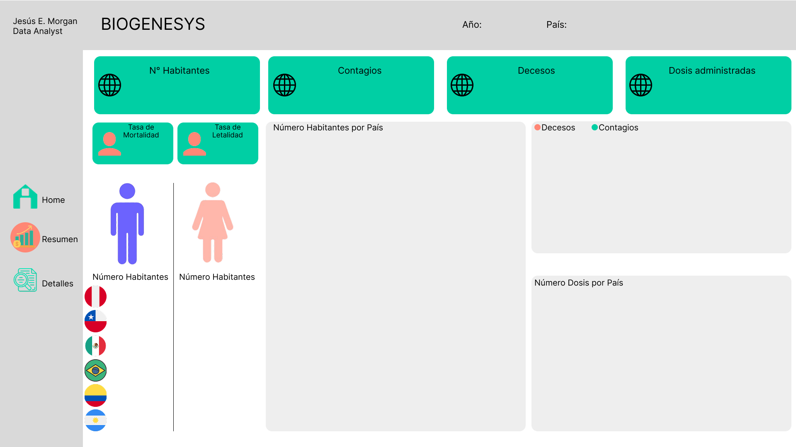

# 🚴‍♂️ Proyecto – Biogenesys

💼 **Autor:** Jesús E. Morgan  
📊 **Data Analyst | Python · Power BI**  
📅 **Entrega:** 05/08/2025  
📂 **Cliente:** Henry Bootcamp  

---

## 📖 Introducción  
La empresa farmacéutica BIOGENESYS busca identificar las ubicaciones óptimas para la expansión de laboratorios farmacéuticos, basándose en el análisis de datos de incidencia de COVID-19, tasas de vacunación, y la disponibilidad de infraestructuras sanitarias. La meta es optimizar la respuesta a los efectos de la pandemia y postpandemia con el fin de mejorar el acceso a las vacunas 

### Objetivos principales:  
- 🧹 Mejorar la **calidad de los datos** mediante limpieza y depuración.  
- 🔗 Construir un **modelo de datos relacional** alineado al negocio.  
- 🧮 Implementar **medidas DAX** para métricas críticas.  
- 🎨 Diseñar **dashboards visuales e intuitivos** para la toma de decisiones.  

---

## 🛠️ Tecnologías y Herramientas  

**Business Intelligence**  
     

**Bases de Datos**  
  

**Lenguaje DAX**  
  

---

## 🔧 Desarrollo del Proyecto  

### 1️⃣ Conexión y Limpieza de Datos en Python  
- Consulté la base “data_latinoamerica.csv” para verificar el total de filas y columnas.  
- Se procedió a aplicar los filtros de los Países a trabajar (Argentina, Chile, Perú, Colombia, Brasil, México) y las fechas desde el 01/01/2021 en adelante.  
- El total de esas filas fue de 3750, lo cual fue mucho más sencillo para poder cargarlo al dataframe y analizar sin problema.
- En el proceso de limpieza aplicamos una validación de filas vacías para eliminarlas en el caso existan, y con respecto a las columnas vacías, todas las que detectamos tenían menos de 1% de celdas vacías a excepción de 2, por lo cual procedimos a rellenarlas con el último valor hacia adelante y hacia atrás; y esas 2 columnas que no rellenamos fue porque tenían más del 60% de filas vacías, y no lo vi adecuado para el análisis respectivo. 

### 2️⃣ Mockup    
- Diseño de un **mockup inicial** para guiar el dashboard.  

### 3️⃣ Medidas DAX principales  
- **N° Habitantes, Contagios, Decesos, Dosis administradas.**  
- **KPIs de variación año contra año (YoY).**    
- **Cálculos de acumulados y comparativos.**  

### 4️⃣ Creación del Tablero    
- Botones de **navegación entre páginas**.  

---

## 📊 Resultados Principales  
Tablero dinámico con:  
- Dosis administradas, Contagios, Decesos y N° Habitantes.  
- Segmentadores por Año y País.  
- Comparaciones interanuales (**YoY**).  
- Documentación organizada de medidas y carpetas.  

👉 El dashboard final facilita la **exploración del total de dosis administradas referente al N° de habitantes** y el **Nivel de contagios**.  

---

---

## 📸 Vista del Dashboard  

### 🔹 Dashboard Principal  
   

---

📂 También puedes explorar el proyecto completo descargando el archivo:  
[Descargar Biogenesys.pbix](assets/Biogeneys.pbix)  

## 🔮 Líneas Futuras  
- Ampliar las medidas DAX para nuevos KPIs.  
- Profundizar en análisis por **País y dosis administradas**.  
- Explorar integración con **datos en tiempo real**.  

---

## 💡 Reflexión Personal  
Este proyecto me permitió afianzar:  
- El orden y precisión en la limpieza de datos apoyándome con Python para manejar grandes volúmenes de datos.  
- El diseño de dashboards profesionales en Power BI.  

---

